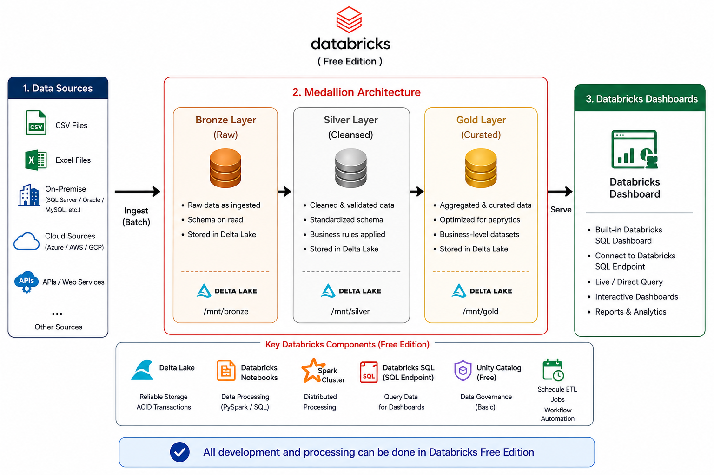
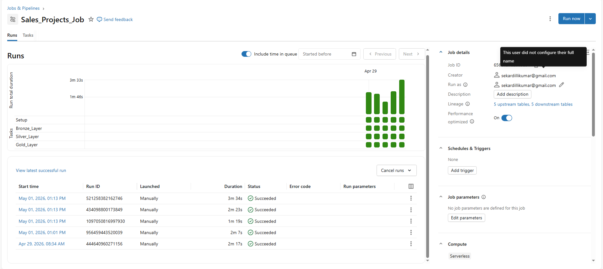
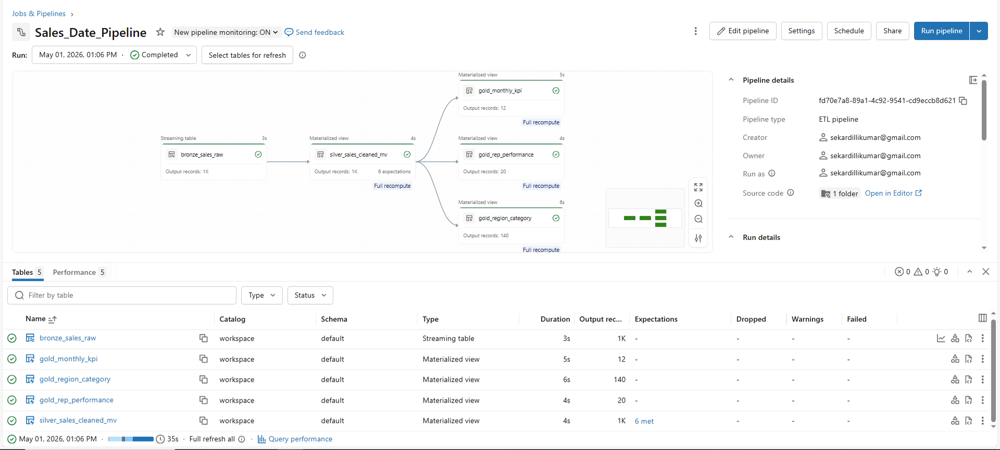
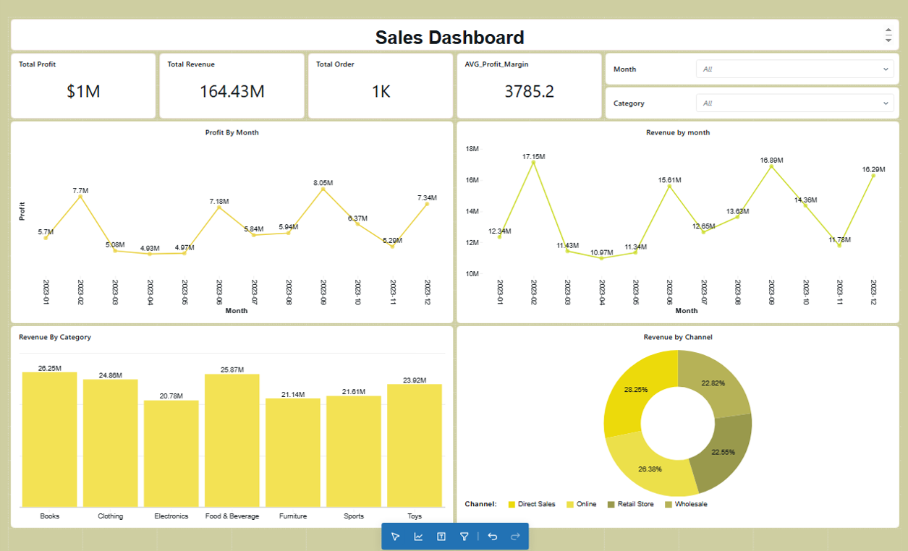

# Databricks Medallion Architecture Project

## 📌 Project Overview

This project demonstrates an end-to-end data engineering architecture using **Databricks Free Edition** and the **Medallion Architecture** pattern.

The solution shows how data is ingested from multiple sources, transformed through Bronze, Silver, and Gold layers in Databricks, and finally for reporting and dashboard creation.

---------------------------------------------------------------------------------------------

# 🏗️ Architecture Diagram

## Data Flow

Data Sources
     ↓
Databricks Free Edition
     ↓
Bronze Layer (Raw Data)
     ↓
Silver Layer (Cleaned Data)
     ↓
Gold Layer (Business Ready Data)
     ↓
Dashboard & job & Pipeline

--------------------------------------------------------------------------------------------
## Project Structure

databricks-medallion-architecture/
│
├── datasets/
│   └── sales_data.csv
|
├── Data Processing/
│   ├── bronze_ingestion.py
│   ├── silver_transformation.py
│   └── gold_aggregation.py
│
├── Catelog Files/
│   └── sales_project_bronze_sales_raw.sql
│   └── sales_project_silver_sales_clean
│   └── sales_project_gold_monthly_kpi
│   └── sales_project_gold_region_category
│   └── sales_project_gold_rep_performance
|
├── images/
│   └── Databricks_Architecture.png
│   └── Sales_Data_Job.png
|   └── Sales_Data_Pipeline.png
│   └── Dashboard.png
│
├── ETL Pipeline/
|   └── sales_data.csv
│   └── transformations
│         └── bronze_sales_raw.py
│         └── silver_sales_cleaned.py
│         └── gold_monthly_kpi.py
│         └── gold_region_category.py
│         └── gold_rep_performance.py
│
└── README.md

---------------------------------------------------------------------------------------------
## Data Sources

The architecture supports multiple data sources:

CSV Files

Excel Files

APIs / Web Services

On-Premise Databases

SQL Server

Oracle

MySQL

Cloud Storage

Azure

AWS

GCP

---------------------------------------------------------------------------------------------

🥉 Bronze Layer (Raw Data)

The Bronze layer stores raw ingested data exactly as received from source systems.

**Purpose**

Store raw historical data

Preserve original schema

Enable replay and auditing

**Features**

Raw ingestion

Append-only storage

Schema-on-read

Delta Lake storage format

---------------------------------------------------------------------------------------------

🥈 Silver Layer (Cleaned Data)

The Silver layer contains cleaned and validated data.

**Purpose**

Data cleansing

Deduplication

Standardization

Business rule implementation

**Features**

Remove nulls and duplicates

Apply transformations

Standardize columns

Data quality validation

---------------------------------------------------------------------------------------------

🥇 Gold Layer (Business Ready Data)

The Gold layer stores curated and aggregated datasets optimized for analytics and reporting.

**Purpose**

Create business-ready tables

Support BI dashboards

Improve query performance

**Features**

Aggregated datasets

KPI calculations

Star schema modeling

Reporting optimization

---------------------------------------------------------------------------------------------

⚙️ Databricks Components Used

Component			          Purpose

Delta Lake			     ACID transactions and reliable storage

Databricks Notebooks		PySpark & SQL development

Spark Cluster			     Distributed processing

Databricks SQL			     Query engine for BI tools

Unity Catalog			     Basic governance and access

Workflow Jobs			     ETL scheduling

---------------------------------------------------------------------------------------------

## Technologies Used

Databricks Free Edition

Apache Spark

PySpark

Delta Lake

Databricks SQL

SQL

---------------------------------------------------------------------------------------------

## Databricks Dashboard 

Live dashboards

KPI monitoring

Interactive reports

Business analytics

Direct Query support

---------------------------------------------------------------------------------------------
## Job & Pipeline

---------------------------------------------------------------------------------------------

## Dashboard  Preview 

--------------------------------------------------------------------------------------------

## Author

Data Engineering Portfolio Project ---- Databricks Free Edition Project

